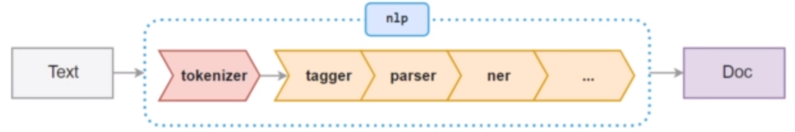
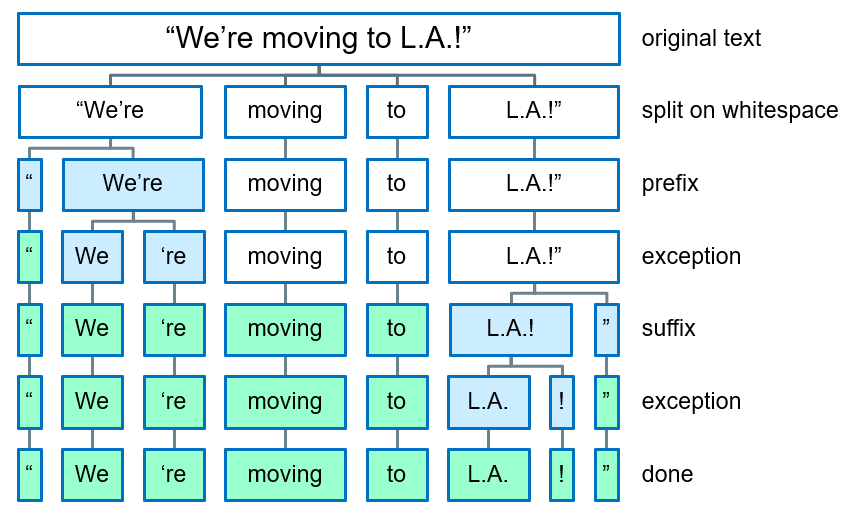
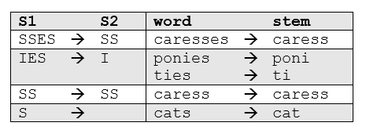
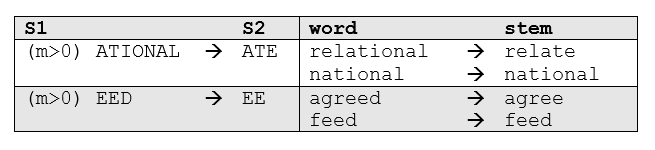
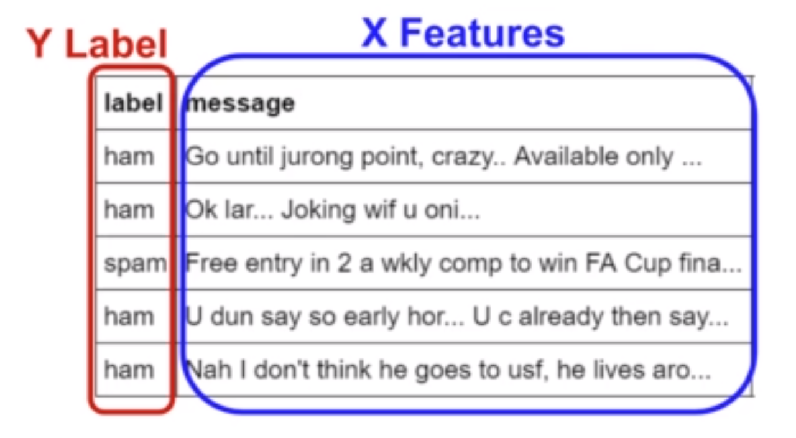
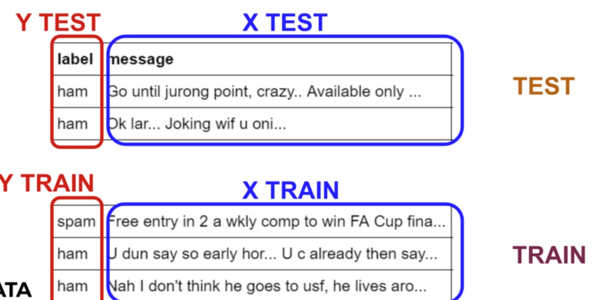
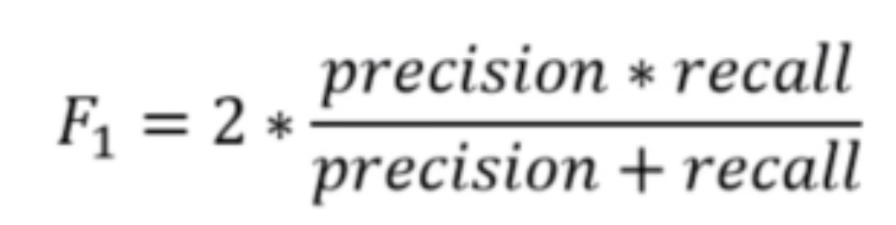
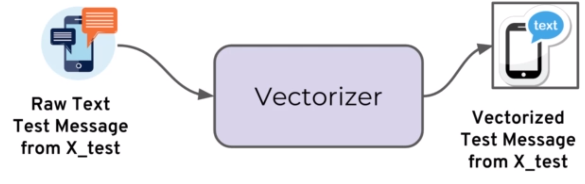
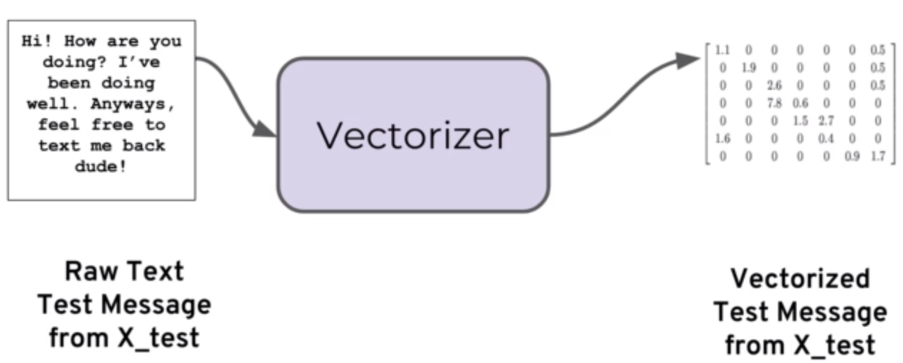

<h1 id="content">NLP - Natural Language Processing</h1>
- <a href="#nlp-basics">Natural Language Processing (NLP) Basics</a>
- <a href="parts-of-speech">Parts of Speech</a>
- <a href="#text-classification">Text Classification</a>

<h1 id="nlp-basics">Natural Language Processing (NLP) Basics</h1>
<a href="#content">Back to Top</a>

- Set up Spacy and Language Library
- Understand Basic NLP Topics:
  - Tokenization
  - Stemming
  - Lemmatization
  - Stop Words
- Spacy for Vocabulary Matching

### What is Spacy

- For many NLP tasks, Spacy only has one implemented method, choosing the most efficient algorithm currently available (often do not have the option to choose other algorithms)

### What is NLTK

- Natural Langugage Toolkit (very popular open source)
- Initially released in 2001 (older than Spacy which released 2015)
- Provides many functionalities, but includes less efficient implementations

### NLTK vs Spacy

|     Requirements      |            NLTK             |                                             Spacy                                             |
| :-------------------: | :-------------------------: | :-------------------------------------------------------------------------------------------: |
| Many common NLP tasks |  Slower and less efficient  | Faster and more efficient (cost of user not being able to choose algorithmic implementations) |
|  Pre-created models   | Typically easier to perform |        Does not include pre-created models for some applications (sentiment analysis)         |

### What is NLP

- Natural Language Processing
- An area of computer science and artificial intelligence concerned with the interactions between computers and human (natural) languages, in particular how to program computers to process and analyze large amounts of natural language data
- Often when performing analysis, lots of data is numerical (sales numbers, physical measurements, quantifiable categories)
- Computers are very good at handling direct numerical information
- As humans, we can tell there is a plethora of information inside of text documents but a computer needs specialized processing techniques in order to "understand" raw text data
- Text data is highly unstructured and can be in multiple languages
- NLP attempts to use a variety of techniques in order to create structure out of text data (basic techniques - built into libraries - Spacy, NLTK)
- Example Use Cases:
  - Classifying Emails (Spam vs Legitimate)
  - Sentiment Analysis of Text Movie Reviews
  - Analyzing Trends from written customer feedback forms
  - Understanding text commands (Google - "Hey Google, play this song")

### NLP Basics

Reference: [01-NLP-Python-Basics](https://github.com/FrostyBackpack/udemy-nlp-natural-language-processing-with-python/tree/main/01-NLP-Python-Basics)

1. [Spacy Basics](https://github.com/FrostyBackpack/udemy-nlp-natural-language-processing-with-python/blob/main/01-NLP-Python-Basics/00-Spacy-Basics.ipynb)
   **nlp()** function from Spacy:

   - automatically takes raw text and performs a series of operations to tag, parse and describe the text data

   

2. [Tokenization](https://github.com/FrostyBackpack/udemy-nlp-natural-language-processing-with-python/blob/main/01-NLP-Python-Basics/01-Tokenization.ipynb)

- Notice that tokens are pieces of original text
- Entity Recognition: we do not see any conversion to words stems or lemmas (base forms of words) and we have not seen anything about organizations/places/money
- Tokens are the basic building blocks of a Doc object (everything that helps us understand the meaning of the text is derived from tokens and their relationship to one another)



- **Prefix**: Character(s) at the beginning `$ ( " ¿`
- **Suffix**: Character(s) at the end `km ) , . ! "`
- **Infix**: Character(s) in between `- -- / ...`
- **Exception**: Special-case rule to split a string into several tokens or prevent a token from being split when punctuation rules are applied

3. [Stemming](https://github.com/FrostyBackpack/udemy-nlp-natural-language-processing-with-python/blob/main/01-NLP-Python-Basics/02-Stemming.ipynb)

- Often when searching text for a certain keyword, it helps if the search returns variations of the word (e.g. searching for "boat" might also return "boats" and "boating" - "boat" would be the stem for [boat, boater, boating, boats])
- Stemming is somewhat crude method for cataloging related words
- It essentially chops off letters from the end until the stem is reached
- Works fairly well in most cases but unfortunately English has many exceptions where a more sophisticated process is required
- Spacy does not include a stemmer, opting instead to rely entirely on lemmatization (use NLTK and learn about various Stemmers - Porter Stemmer and Snowball Stemmer)

  1.  Porter's Algorithm

  - One of the most common and effective stemming tools
  - Developed by Martin Porter in 1980
  - The algorithm employs five phases of word reduction, each with its own set of mapping rules

  - First phase: simple suffix mapping rules are defined

    

    - From a given set of stemming rules only one rule is applied, based on the longest suffix S1 (e.g. caresses reduces to caress but not cares)

  - More sophisticated phases consider the length/complexity of the word before applying a rule

    

  2.  Snowball

  - Name of a stemming language
  - Developed yb Martin Porter
  - The algorithm used here is more accurately called "English Stemmer" or "Porter2 Stemmer"
  - Offers a slight improvement over the original Porter stemmer (both in logic and speed)

4. [Lemmatization](https://github.com/FrostyBackpack/udemy-nlp-natural-language-processing-with-python/blob/main/01-NLP-Python-Basics/03-Lemmatization.ipynb)

- In constrast to stemming, lemmatization looks beyond word reduction, and considers a language's full vocabulary to apply a morphological analysis to words
- The lemma of "was" is "be" and the lemma of "mice" is "mouse". The lemma of "meeting" might be "meet" or "meeting" depending on its use in a sentence
- Lemmatization looks at surrounding text to determine a given word's part of speech, it does not categorize phrases

5. [Stop Words](https://github.com/FrostyBackpack/udemy-nlp-natural-language-processing-with-python/blob/main/01-NLP-Python-Basics/04-Stop-Words.ipynb)

- Words like "a" and "the" appear so frequently that they do not require tagging as thoroughly as nouns, verbs and modifiers
- Filtered from text to be processed
- Spacy holds a built-in list of some 305 English stop words

6. [Phrase Matching and Vocabulary](https://github.com/FrostyBackpack/udemy-nlp-natural-language-processing-with-python/blob/main/01-NLP-Python-Basics/05-Vocabulary-and-Matching.ipynb)

- Identify and label specific phrases that match patterns we can define ourselves
- We can think of this as a powerful version of Regular Expression where we actually take parts of speech into account for our pattern search

<h1 id="parts-of-speech">Parts of Speech Tagging</h1>
<a href="#content">Back to Top</a>

<h1 id="text-classification">Text Classification</h1>
<a href="#content">Back to Top</a>

- The specific case of machine learning we will be conducting (**supervised learning**)

### What is Machine Learning

- Machine learning is a method of data analysis that automates analytical model building
- Using algorithms that iteratively learn from data, machine learning allows computers to find hidden insights without being explicitly programmed where to look

### What is it used for

| Fraud detection | Recommendation Engines |
| Web search results| Customer Segmentation |
| Real-time ads on web pages | Text Semtiment Analysis |
| Credit scoring and next-best offers | Predicting Customer Churn |
| Prediction of equipment failures | Pattern and image recognition |
| New pricing models | Email spam filtering |
| Network intrusion detection | |

### Supervised Learning

- **Supervised learning** algorithms are trained using **labeled** (an input where the desired output is known)
- Example - a segment of text could have a category label such as:
  - Spam vs. Legitimate Email
  - Positive vs. Negative Movie Review
- The learning algorithm receives a set of inputs along with the corresponding correct outputs, and the algorithm learns by comparing its actual output with correct outputs to find errors
- It then modifies the model accordingly
- Supervised learning is commonly used in applications where historical data predicts likely future events
- Text classification and recognition is a very common and widely applicable use of machine learning

### Machine Learning Process


1. Data Acquisition

- Get your data (customers, sensorsm etc)

2. Data Cleaning

- Clean and format your data (using SciKit Learn and Vectorization)

3. Training Data [Model Training and Building]

- Split the data into training data/set and test data/set
- Grab your machine learning model and have it learn/train off that training data (fitting the model to training data)
- Machine learning model is going to attempt as best as it can
- Training set is commonly about 70% of total data

4. Test Data [Model Testing]

- For evaluation, it makes sense to use data that the model has never seen before (separate test data set)
- Test data set is commonly about 30% of total data
- Test using model testing to evaluate the performance using different evaluation metrics

5. Model Deployment

- After evaluating the model, we can decide to improve the model (go back to model training and building phase, adjust some parameters and essentially repeat these processes until we are satisfied with our model's performance), then we deploy model

### Model Evaluation

- Focus on train/test split that occurred and learn a few terms (imagine a full data set of Ham vs Spam text messages)
  

- Before the split, we have labels (Y Labels) and features (X Features)
  

- Before we fit the model, we split the data
  

- Notice how after a train test split we always end up with 4 components (X_train, X_test, Y_train, Y_test)

- These 4 components are simply the result of the train/test split groups being separated between features and labels

- After our machine learning process is complete, we will use performance metrics to evaluate how our model did

### Model Evaluation - Classification Metrics

- The key classification metrics we need to understand:

  - Accuracy

    - Accuracy in classification problems is the **number of correct predictions** made by the model divided by the **total number of predictions**
    - E.g. If the X_test set was 100 messages and our model **correctly** predicted 80 messages, then we have **80/100 = 0.8 or 80% accuracy**
    - Useful when target classes are well balanced (**NOT** a good choice with **unbalanced** classes - such situation we want to understand **recall** and **precision**)

  - Recall

    - Ability of a model to find **all** the relevant cases within a dataset
    - The precise definition of recall is the **number of true positives divided by the number of true positives plus the number of false negatives**

  - Precision

    - Ability of a classification model to identify **only** the relevant data points
    - Precision is defined as the number of **true positives divided by the number of true positives plus the number of false positives**

  - F1-Score
    - Recall and Precision
      - Often have a trade-off between recall and precision
      - While recall expresses the ability to find all relevant instances in a dataset, precision expresses the proportion of the data points our model says was relevant actually were relevant
    - In cases where we want to find an optimal blend of precision and recall we can combine the two metrics using what is called F1 score
    - It is the harmonic mean of precision and recall taking both metrics into account in the following equation:
      
    - Use harmonic mean instead of a simple average because it punishes extreme values (a classifier with a precision of 1.0 and a recall of 0.0 has a simple average of 0.5 but an F1 score of 0)

- Typically in any classification task, your model can only achieve two results:

  - Either your model was **correct** in its prediction
  - Or your model was **incorrect** in its prediction

- Fortunately incorrect vs correct expands to situations where you have multiple classes

- For purposes of explaining metrics, lets imagine binary classification situation - only have 2 available classes

  - E.g. We will attempt to predict if a text is Spam or Ham (legitimate). Since this is supervised learning, we will first fit/train a model on training data, then test the model on testing data. Once we have the model's predictions from X_test data, we compare it to the true y values (the correct labels)

- Note: there will be a few steps to convert the raw text into a format that machine learning model can understand




- Set up this vectorization in a pipeline and there are many ways of transforming the raw text into numerical information


- We repeat this process for all the text messages in our X test data. At the end, we will have a count of correct matches and a count of incorrect matches, The key realization we need to make is that **in the real world, not all incorrect or correct matches hold equal value** (single metric will not tell the complete story in real world)

- Organize our predicted values compared to the real values in a **confusion matrix**

### Model Evaluation - Confusion Metrics

- In a classification problem, during testing phase you will have two categories:
  - True condition (a text message is SPAM)
  - Predicted condition (ML Model predicted SPAM)
- If you have two possible classes, you should have 4 separate groups at the end of testing:
  - Correctly Classified to Class 1: TRUE HAM
  - Correctly Classified to Class 2: TRUE SPAM
  - Incorrectly Classified to Class 1: FALSE HAM
  - Incorrectly Classified to Class 2: FALSE SPAM


- Main point to remember with the confusion matrix and various calculated metrics is that they are all fundamentally ways of comparing the predicted values versus the true values (what constitutes "good" metrics, will really depend on specific situation)

### Scikit Learn

Reference: [Scikit Learn Primer](https://github.com/FrostyBackpack/udemy-nlp-natural-language-processing-with-python/blob/main/03-Text-Classification/00-SciKit-Learn-Primer.ipynb)

- Most popular machine learning package for Python and has a lot of algorithms built-in

```
    conda install scikit-learn
            OR
    pip install scikit-learn
```

- Every algorithm is exposed in scikit-learn via an "Estimator" (**Estimator parameter(s)**: all parameters of an estimator can be set when it is instantiated and have suitable default values)
- First import the model, the general form is:

```
    from sklearn.family import Model
    from sklearn.linear_model import LinearRegression

    model = LinearRegression(normalize=True)
    print(model)

    LinearRegression(copy_X=True, fit_intercept=True, normalize=True)
```

- Once you have your model created with your parameters, it is time to fit model on some data. But remember, we should split this data into a training set and a test set
- After splitting data, we can train/fit our model on training data through model.fit() method:

```
    model.fit(X_train, y_train)
```

- Now model has been fit and trained on the training data
- The model is ready to predict labels/values on test set
- We get predicted values using predict method:

```
    predictions = model.predict(X_test)
```

- We can then evaluate our model by comparing our predictions to the correct values

- The evaluation method depends on what sort of machine learning algorithm we are using (Regression, Classification, Clustering, etc)
